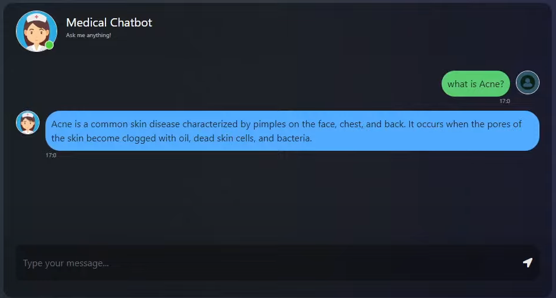
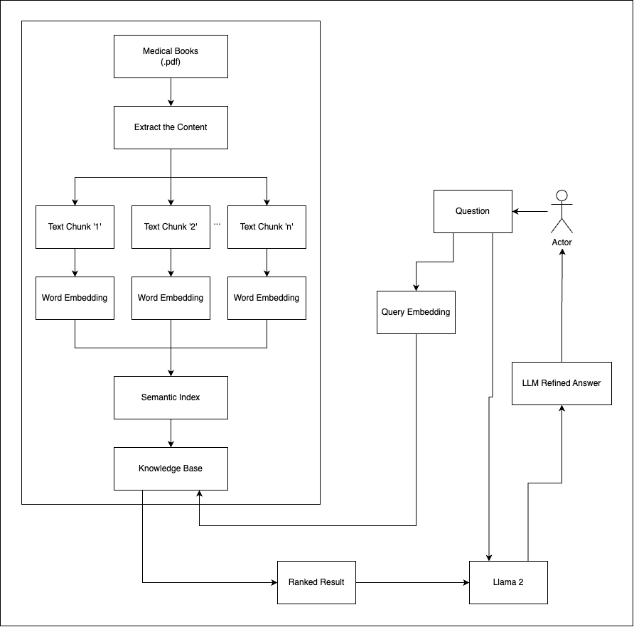

# Healthpedia AI: Your Wellness Companion

  

## Project Overview:

HealthPedia AI is a comprehensive medical chatbot designed to answer a wide range of disease and medicine-related questions. It utilizes the extensive knowledge base provided by 'The GALE ENCYCLOPEDIA of MEDICINE' and employs advanced technologies to deliver accurate and insightful responses.

  

## Tech Stack:

- **Python:** Core programming language for development.
- **LangChain, RetrievalQA:** Enables an end-to-end pipeline for question answering.
- **Flask:** Web application framework used for frontend development.
- **Meta Llama2 (LLM model):** Powers the answer refinement process.
- **Pinecone:** Vector Database for storing word embeddings and semantic search.
- **HuggingFace embeddings:** Enhances the language model capabilities.

## Project Flow:

  

1. **Load Corpus:** Import the contents of 'The GALE ENCYCLOPEDIA of MEDICINE'.
2. **Corpus Chunking:** Divide the corpus into manageable chunks for efficient processing.
3. **Embedding Conversion:** Convert chunks into embeddings for semantic representation.
4. **Pinecone Indexing:** Store the embeddings in Pinecone for an optimized knowledge base.
5. **Web Application (Flask):** User interacts with the chatbot through the frontend.
6. **User Query Handling:** Retrieve relevant chunk embeddings from the Pinecone vector database.
7. **LLM Integration:** Provide user question and relevant context to LLM (Llama2) for answer refinement.
8. **Display Output:** Showcase LLM's refined answer on the web application's chatbot window.

## Repository Structure:

- **./:** Contains the source files for the project.
- **/data:** Includes the medical book corpus and other relevant datasets (if added).
- **/model:** LLM model.
- **/templates:** Files related to the Flask web application.

## Getting Started:

1. Clone the repository: `git clone https://github.com/sameeerjadhav/HealthPedia-AI.git`
2. Install dependencies: `pip install -r requirements.txt`
3. Follow setup instructions for each component (LangChain, RetrievalQA, Flask, Meta Llama2, Pinecone, HuggingFace).
4. Run the application: `python app.py`

## Contribution Guidelines:

If you'd like to contribute to HealthPedia AI, please follow the guidelines outlined in [CONTRIBUTING.md](./docs/CONTRIBUTING.md).

## License:

This project is licensed under the [MIT License](LICENSE).

---

Feel free to customize this README template based on your specific details and preferences.
